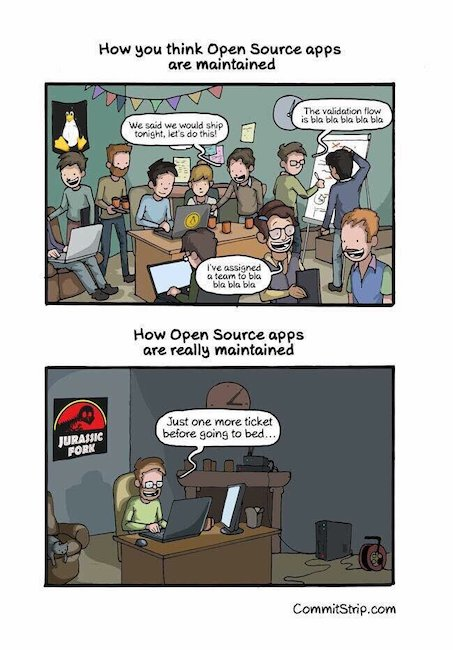

## Thoughts on a possible Future of TYPO3

## Disclaimer

[image source: Querbilder](http://www.querbilder.de/cartoons/189_hellseher_glaskugel.gif)

## "Soft" Topic

## Team structure

Note: There are reasons but: hierarchical/waterfall, no shared responsibility, complicated

## Developing things right

- "We" are pretty good at it

Note: Testing, CGL, Architecture

## Developing the right thing

## Who is developing something for whom?

Note: TYPO3 Shortcomings Examples: Security, Accessibility, Performance (e.g. Page Tree) 

## What now?

## I don't know, let's find out together

## Not everything is code

- Documentation
- Mentoring
- Discussions and Decisions
- Be open, be inclusive, be respectful, listen
- 6 eyes merge rule is not enough for diverse perspectives

## Not everything is bad

## Deferred Image Processing

## The problem

## Scaling (large) images takes time 

## Scaling images from remote storage takes more time 

## Scaling many images in multiple variants from remote storage breaks your site  

## I tested this for you

- Photographer web site
- One pager
- 15 image galleries with 25 images in 4 responsive variants
- Each image > 10mb in size  
- Processing time for first hit: ~10 MINUTES

## TYPO3 9.5 and 10.4 implementation

## Limitations

- Backend only
- Image dimensions not known upfront
- Deferred processing not default, thus not consistently used
- Always delivered through PHP endpoint
- Not cachable in browser

## Approaching these limitations

- Recognition
- Initiative
- Gathering view points
- Discussion
- Concept
- Agreement
- Execution

## Deferred Image Processing

- Will land in 10.4 as bug fix 

## Improvements

- Currently backend only, but open for other implementations
- Image dimensions calculated upfront 
- All images (in backend) are processed asynchronously
- Passed through PHP only when not processed yet
- Processed images are browser cachable

## My learnings

- Coding is required, but only one (sometimes small) part
- Doing the right thing takes time
- Doing the right thing is fun and satisfying

## Other modes for more complex topics

## Not everything needs to be "in the core" immediately

- More freedom to experiment
- More and faster iterations
- Workarounds can easier be found
- Limitations of current TYPO3 API can be uncovered and fixed

## CLI interface

- TYPO3 Console can be used **now**
- TYPO3 is changed iteratively to allow integration
- It **will** happen
- It takes time

## Secure Web Root

- helhum/typo3-secure-web
- see CLI

## Crontab

- helhum/typo3-crontab
- "Better scheduler"

## Structured content/ content grids

- container
- gridelements
- flux

## What about content repository?

- We should think in that direction
- We should experiment
- We could try to iteratively change TYPO3 to allow replacing the storage layer
- It takes time

## Take home messages

- Be open for crazy ideas
- Talk with each other
- Listen to others
- Plan
- Be patient, take your time
- Be respectful
- Wear a mask
- Stay safe
